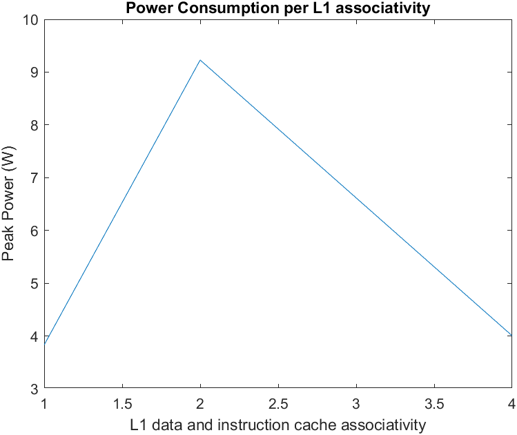
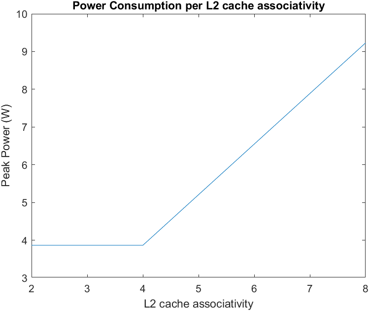
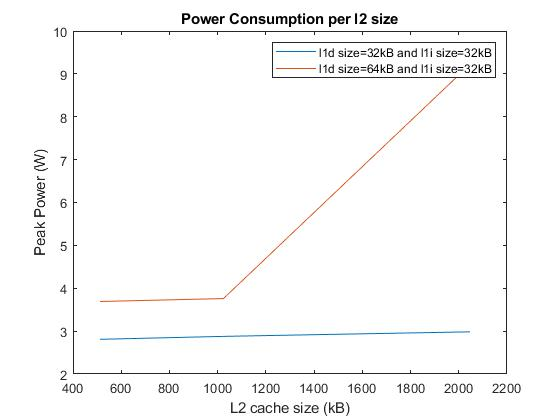
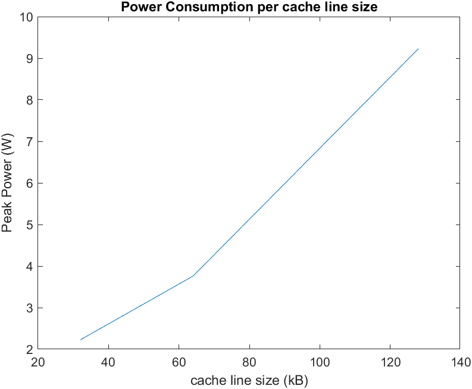

# Αρχιτεκτονική Υπολογιστών
## Πάκας Μάριος 9498
## Μέτα Λουίς-Κοσμάς 9390
### Εργαστήριο 3  


---
### Περιεχόμενα
   1. [Βήμα 1ο](#1)
      1. [Πρώτο ερώτημα](#1_1)
      2. [Δεύτερο ερώτημα](#1_2)
      3. [Τρίτο ερώτημα](#1_3)
   2. [Βήμα 2ο](#2)
      1. [Πρώτο ερώτημα](#2_1)
      2. [Δεύτερο ερώτημα](#2_2)
   3. [Βιβλιογραφία](#3)
   4. [Κριτική](#4)  
   

<a name="1"></a>
## Βήμα 1ο

Στο συγκεκριμένο βήμα δοκιμάσαμε όπως ζητήθηκε από την εκφώνηση να τρέξουμε το McPAT για τους επεξεργαστές Xeon και Niagara.  

<a name="1_1"></a>
a) Πρώτο ερώτημα  

Αναζητώντας βιβλιογραφία για το dynamic power συμπεράναμε πως υπάρχουν 3 είδη power dissipation, το _dynamic_, το _static_ και το _short-circuit power_. Πιο συγκεκριμένα, προέκυψαν τα παρακάτω σημεία που θεωρούμε πως περιέχουν αναλυτικά την ζητούμενα πληροφορία:

**Power Modeling**  
   - Power dissipation of CMOS circuits has three main components: dynamic, short-circuit, and leakage power. Circuits dissipate dynamic power when they charge and discharge the capacitive loads to switch states. Dynamic power is proportional to the total load capacitance, the supply voltage, the voltage swing during switching, the clock frequency, and the activity factor. We calculate the load capacitance of a module by decomposing it into basic circuit blocks, and using analytic models for each block with appropriately sized devices. We calculate the activity factor using access statistics from architectural simulation together with circuit properties. Switching circuits also dissipate short-circuit power due to a momentary short through the pull-up and pull-down devices. We compute the short-circuit power using the equations derived in the work by Nose et al. [32] that predicts trends for short-circuit power. If the ratio of the threshold voltage to the supply voltage shrinks, short-circuit power becomes more significant. It is typically about 10% of the total dynamic power, however it can be as high as 25% of the dynamic power in some cases.
 
 
The **dynamic power** (switching power) dissipated per unit of time by a chip is C·V2·A·f, where C is the capacitance being switched per clock cycle, V is voltage, A is the Activity Factor indicating the average number of switching events undergone by the transistors in the chip (as a unit-less quantity) and f is the switching frequency. Voltage is therefore the main determinant of power usage and heating. The voltage required for stable operation is determined by the frequency at which the circuit is clocked, and can be reduced if the frequency is also reduced. Dynamic power alone does not account for the total power of the chip, however, as there is also static power, which is primarily because of various leakage currents. Due to static power consumption and asymptotic execution time it has been shown that the energy consumption of a piece of software shows convex energy behavior, i.e., there exists an optimal CPU frequency at which energy consumption is minimal. Leakage current has become more and more important as transistor sizes have become smaller and threshold voltage levels lower. A decade ago, dynamic power accounted for approximately two-thirds of the total chip power. The power loss due to leakage currents in contemporary CPUs and SoCs tend to dominate the total power consumption. In the attempt to control the leakage power, high-k metal-gates and power gating have been common methods.

Dynamic power refers to the power dissipated due to voltage and, although it was the main power dissipation in the past, in contemporary CPUs, due to lower voltages and smaller transistors, the leakage current is also a factor in total power.

Όσον αφορά το leakage βρήκαμε πως υπάρχουν δύο μηχανισμοί, το _Subthreshold leakage_ και το _Gate leakage_. Παρατηρήσαμε επίσης ότι εξαρτάται από πολλές παραμέτρους το _leakage_ και ότι το _Subthreshold leakage_ έχει μεγαλύτερη τιμή από το _Gate leakage_ σε κάθε περίπτωση.  

**Leakage power** consumption is the power consumed by the sub threshold currents and by reverse biased diodes in a CMOS transistor. The leakage power of a CMOS logic gate does not depend on input transition or load capacitance and hence it remains constant for a logic cell.


If we run two different programs on the same processor only the dynamic power may change since only the A may change. The leakage power is constant.  

Σύμφωνα με το παραπάνω, αν τρέξουμε δύο διαφορετικά προγράμματα σε έναν επεξεργαστή θα επηρεαστεί μόνο το dynamic power και καθόλου το leakage.


Dynamic power only cares about the frequency, the voltage and the activity factor, which means that a bigger program does not necessarily translates to bigger power consumption if  it does not change the switching events rate (on a per unit of time measurement. Of course in total it will take more time to complete, thus probably bigger power dissipated). At the same time leakage power is constant and does not change, so again, on a per unit measurement, the power dissipated will be the same on both programs!  

Με βάση όσα αναφέρονται στην προηγούμενη παράγραφο, συμπεραίνουμε πως δεν έχει σημασία η χρονική διάρκεια εκτέλεσης για την καταναλισκόμενη ισχύ. Προφανώς όμως, η συνολική ενέργεια είναι μεγαλύτερη στο πιο χρονοβόρο πρόγραμμα.


Το παρακάτω McPAT Framework μας βοηθάει στο να αντιληφθούμε περαιτέρω την λειτουργία του McPAT.


[Πηγή](https://www.hpl.hp.com/research/mcpat/micro09.pdf)

<a name="1_2"></a>
b) Δεύτερο ερώτημα   

Αναζητώντας στην βιβλιογραφία και έπειτα από σκέψη καταλήξαμε πως για να απαντήσουμε σε αυτό το ερώτημα θα χρειαστεί να γνωρίζουμε πληροφορίες για το sleep mode του κάθε επεξεργαστή. Ουσιαστικά, με σωστή χρήση του sleep mode έχουμε μεγαλύτερη διάρκεια μπαταρίας. Με τα αποτελέσματα που παράγει το McPAT θα μπορούσαμε να δούμε τις τιμές για το total power των δύο επεξεργαστών -με μια απόκλιση βέβαια από την πραγματικότητα- και να αποφανθούμε με επιφύλαξη για την διάρκεια της μπαταρίας. Αυτό βέβαια υπό την προϋπόθεση ότι οι δύο επεξεργαστές έχουν την ίδια λειτουργία για sleep,dream και snore mode. Επομένως ναι εφόσον τα 4 W και τα 40 W αναφέρονται σε peak power τότε προφανώς αυτό δεν σημαίνει ότι ο επεξεργαστής καταναλώνει διαρκώς αυτή την ισχύ. Για να αποφανθούμε θα πρέπει να υπολογίσουμε τη μέση κατανάλωση κάθε επεξεργαστή και αυτό μπορεί να εξαρτηθεί και από την διεργασία που έχει να κάνει.

Το McPAT μπορεί να μας δώσει στοιχεία όπως το Peak power, το total leakage, ωστόσο το runtime dynamic και το total leakage μπορούν να μας δώσουν μία πολύ καλύτερη ιδέα για την μέση ισχύ που καταναλώνει ο επεξεργαστής. Χρειάζεται η χρήση αυτών των δεδομένων μέσω ενός μαθηματικού τύπου για να καταλήξουμε σε ένα συγκρίσιμο αποτέλεσμα ανα μονάδα χρόνου. Έτσι μέσω του McPAT και με την αξιοποίηση κάποιου μαθηματικού τύπου θα μπορούσαμε να οδηγηθούμε στο ζητούμενο αποτέλεσμα.

There are several factors contributing to the CPU power consumption; they include dynamic power consumption, short-circuit power consumption, and power loss due to transistor leakage currents:

P_{cpu}=P_{dyn}+P_{sc}+P_{leak}}


<a name="1_3"></a>
c) Τρίτο ερώτημα    

Μπορεί ο Xeon να είναι 40 φορές γρηγορότερο από ο A9 αλλά θα πρέπει να ληφθεί υπόψιν και το leakage που έχουμε σε κάθε περίπτωση. Για τον Xeon έχουμε ```Total Leakage = 36.8319 W``` ενώ για τον A9 έχουμε ```Total Leakage = 0.108687 W``` που είναι τουλάχιστον 300 φορές μικρότερο από το πρώτο. Αυτό μας οδηγεί στο συμπέρασμα ότι δεν είναι πιο energy efficient ο Xeon από τον Α9.

---
<a name="2"></a>
## Βήμα 2ο

Για το συγκεκριμένο βήμα χρησιμοποιήθηκαν από το προηγούμενο εργαστήριο τα πειράματα που προέκυψαν. Ωστόσο, επειδή στο προηγούμενο εργαστήριο πήραμε περίπου 20 προσομοιώσεις για κάθε benchmark σκεφτήκαμε πως τώρα η καλύτερη λύση είναι να δημιουργήσουμε μερικά scripts και να εργαστούμε με αυτά ευκολότερα. Συνεπώς, τα παρακάτω αποτελέσματα προέκυψαν με χρήση αυτών των [_Scipts_](https://github.com/lkmeta/computer-architecture-lab3/tree/main/2.1/Scripts).


<a name="2_1"></a>
a) Πρώτο ερώτημα    
Τα αποτελέσματα για τις προσομοιώσεις του κάθε Benchmark που υλοποιηθήκαν από το προηγούμενο εργαστήριο χρησιμοποιήθηκαν για να προκύψουν οι μετρήσεις με το McPAT. Οι τιμές των ```Core``` και ```L2``` για το _Area_, _Subthreshold Leakage_, _Gate Leakage_ και _Runtime Dynamic_ σε κάθε ένα από τα Benchmarks φαίνονται στα παρακάτω αρχεία:

   - [**specbzip**](https://github.com/lkmeta/computer-architecture-lab3/blob/main/2.1/core_l2_results/results_specbzip)
   - [**spechmmer**](https://github.com/lkmeta/computer-architecture-lab3/blob/main/2.1/core_l2_results/results_spechmmer)
   - [**speclibm**](https://github.com/lkmeta/computer-architecture-lab3/blob/main/2.1/core_l2_results/results_speclibm)
   - [**specmcf**](https://github.com/lkmeta/computer-architecture-lab3/blob/main/2.1/core_l2_results/results_specmcf)
   - [**specsjeng**](https://github.com/lkmeta/computer-architecture-lab3/blob/main/2.1/core_l2_results/results_specsjeng)
   
Έπειτα, με χρήση των ```print_energy_res.sh``` και ```get_energy.sh``` Sripts καταφέραμε να υπολογίσουμε και να πάρουμε άμεσα την **ενέργεια** και το **EDP** όπως φαίνεται στα παρακάτω αρχεία για κάθε περίπτωση:

   - [**specbzip**](https://github.com/lkmeta/computer-architecture-lab3/blob/main/2.1/energy_results/results_specbzip)
   - [**spechmmer**](https://github.com/lkmeta/computer-architecture-lab3/blob/main/2.1/energy_results/results_spechmmer)
   - [**speclibm**](https://github.com/lkmeta/computer-architecture-lab3/blob/main/2.1/energy_results/results_speclibm)
   - [**specmcf**](https://github.com/lkmeta/computer-architecture-lab3/blob/main/2.1/energy_results/results_specmcf)
   - [**specsjeng**](https://github.com/lkmeta/computer-architecture-lab3/blob/main/2.1/energy_results/results_specsjeng)


Το καλύτερο EDP για κάθε Benchmark φαίνεται στην τελευταία στήλη του παρακάτω πίνακα:

| Benchmark Name | l1_dsize (kB) | l1_icache (kB) | l2_size (kB) | l1d_assoc | l1i_assoc | l2_assoc | cacheline_size (kB) | BEST EDP |
| :---: | :---: | :---: | :---: | :---: | :---: | :---: | :---: | :---: | 
| **specbzip**  | 32	| 32	| 2048	| 2	| 2	| 8	| 64	| 23.46504 |
| **spechmmer** | 32	| 32	| 1024	| 2	| 2	| 8	| 64	| 0.000003 |
| **speclibm**  | 32	| 32	| 1024	| 1	| 1	| 2	| 64	| 0.091957 |
| **specmcf**   | 32	| 32	| 512  	| 2	| 2	| 8	| 64	| 13.615531|
| **specsjeng** | 32	| 32	| 512 	| 2	| 2	| 8	| 64	|408.829745|

Παρατηρώντας τον παραπάνω πίνακα προκύπτει ότι μάλλον η καλύτερη λύση για να έχουμε το μικρότερο δυνατό EDP είναι όταν έχουμε τις ακόλουθες τιμές:
   - L1 data cache size = 32 kB
   - L1 instruction cache size = 32 kB
   - L2 cache size = 512 kB 
   - L1 data cache associativity = 2
   - L1 instruction cache associativity  = 2
   - L2 cache associativity = 8
   - cache line size = 64 kB

<a name="2_2"></a>
b) Δεύτερο ερώτημα  

Στο συγκεκριμένο ερώτημα βρήκαμε το _power peak_ μέσω του ```get_peak_power.sh``` script για όλα τα Benchmarks και για κάθε προσομοίωση με σκοπώ να δημιουργήσουμε τα παρακάτω διαγράμματα στο Matlab.

###Διάγραμμα Power Peak συναρτήσει L1 data and instruction cache associativity



###Διάγραμμα Power Peak συναρτήσει L2 cache associativity



###Διάγραμμα Power Peak συναρτήσει L2 cache size



###Διάγραμμα Power Peak συναρτήσει cache line size




<a name="3"></a>
# Βιβλιογραφία
- https://ieeexplore.ieee.org/document/5375438/authors  
- https://www.hpl.hp.com/research/mcpat/micro09.pdf 
- https://asic-soc.blogspot.com/2008/03/leakage-power-trends.html#:~:text=Leakage%20power%20consumption%20is%20the,a%20short%20amount%20of%20time.
- https://en.wikipedia.org/wiki/Dynamic_frequency_scaling 

<a name="4"></a>
# Κριτική 

